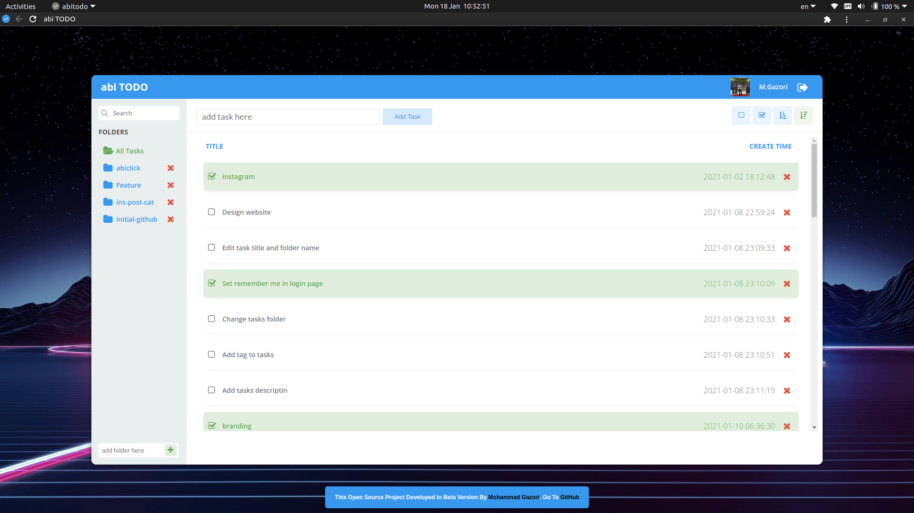

  
  <h3 align="center">abi ToDo</h3>
  <h5 align="center">version 1.0.0-beta (January 19 2021)</h5>
  

    Easy management of everything!
     
    <a href="https://abitodo.ir">View In WebSite</a>
    |
    <a href="https://github.com/mgazori/abitodo/issues">Report Bug</a>
    |
     <a href="https://github.com/mgazori/abitodo/issues">Request Feature</a>
  

## Table of Contents
- [Table of Contents](#table-of-contents)
- [About abitodo](#about-abitodo)
- [Built with](#built-with)
- [Setup training](#setup-training)
- [Features](#features)
- [Features in future updates](#features-in-future-updates)
- [Screenshot](#screenshot)
- [Important things](#important-things)
- [Bugs in the project](#bugs-in-the-project)
- [Contact with me](#contact-with-me)
- [License](#license)

## About abitodo
This project is licensed under the terms of the MIT license and developed by Mohammad Gazari.
This project in beta version and has also been developed procedurally.
Version 1.0.0 stable of the program will be completely rewritten on 22 MAY 2021 and will be released under object-oriented programming (oop). During this time you have the opportunity to use the project for yourself as well as give feedback or request features that you would like to be added to the project.
be successful and victorious.

## Built with
- PHP 8
- HTML 5
- CSS 3
- JavaScript
- JQuery 3.5.1
- Ajax
- SweetAlert 2
- FontAwesome 4.7.0
- MariaDB 10.4.17 (You can use MySQL and...)
- DB-Connection (PDO)

## Setup training
 1. Create a database of your choice and import the tables from the Tables.sql file at the root of the project.
 2. Enter the bootstrap folder and set your database information in the config.php file.
 3. Enter the bootstrap folder and set your information in the constants.php file.

## Features
- Register and login users
- Strong password recognition for the user
- Verify the user's email
- Keep user login for 20 days
- BCRYPT method to store user password
- Save the token in the cookie and database to identify the user
- User logout
- Reset password
- Email authentication to reset password
- Eject other login devices after reset password
- high security
- Prevent sql injection
- Utf8mb4 character
- Use Ajax
- Create a folder
- Task folder
- Create tasks
- Change task status
- Filter tasks
- Search for tasks
- Delete folders
- Delete tasks
- Display Gravatar image of user
- High speed

## Features in future updates
- Edit task names
- Edit folder names
- Improved UI
- Responsiveness of the whole project
- Two-factor authentication for user login
- Login using social networks
- Report a problem
- Change the Tasks folder
- Add tags to tasks
- Add descriptions to tasks
- Add locations to tasks
- Added files to tasks
- Share a folder and work as a team
- Display the number of tasks in each folder
- Set the task as important
- Add password to folder
- Show list of login IPs
- Eject all devices except the current device
- Eject the selected device
- Two-way encryption of all information (in the stable version)
- PWA (in the stable version)
- Persian language (in the stable version)
- and more...

## Screenshot

## Important things
 1. This app can be used on mobiles and tablets but has not yet been optimized for these devices.
 2. You can use our service at [abitodo.ir](https://abitodo.ir/) without launching this program.
 3. Your pull requests are all reviewed and accepted if possible.

## Bugs in the project
My good friend, if you find a bug in the project, you can let me and other friends know via GitHub. [https://github.com/mgazori/abitodo/issues](https://github.com/mgazori/abitodo/issues)

## Contact with me
 - Get in touch with me through my personal website. [mgazori.com](https://mgazori.com)
 - By Email [info@mgazori.com](mailto:info@mgazori.com)

## License
You can check out the full license [here](https://github.com/MGazori/abitodo/blob/main/LICENSE)

This project is licensed under the terms of the MIT license. © [Mohammad Gazori](https://github.com/mgazori)